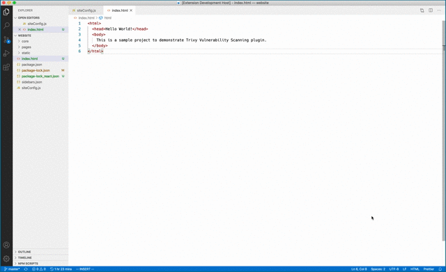

# Trivy Vulnerability Scanner Plugin

Trivy Vulnerability Scanner is a VS Code plugin that helps you find vulnerabilities in your software projects
without leaving the comfort of your VS Code window.

## Demo 

### Findings Explorer

The Trivy VS Code plugin now has a findings explorer which allows you to more easily navigate the config and vulnerability findings in your project

## Requirements

1. [Trivy](https://github.com/aquasecurity/trivy#installation) version v0.9.1 and above.

## Known Issues

If you find one, please file a GitHub Issue [here](https://github.com/aquasecurity/trivy-vscode-extension/issues/new).

## Feature Requests

Have a feature you desire? Please let us know by filing an issue [here](https://github.com/aquasecurity/trivy-vscode-extension/issues/new).

## Release Notes

### 1.0.0

- Add support for installing and updating a built in version of Trivy
- Add support for the Aqua plugin
  - Use Aqua Key and Secret to get Assurance results
- Rework the Tree view to be more informative
- Only allow single runs to happen at anyone time
- Rework the icons to be more consistent
- Switch to using webpack to package vsix and streamline significantly

### 0.9.0

- Add Trivy findings to the Problems view

### 0.8.0
- Add support for managing the config through the UI
- Add support for multiple workspaces in the explorer
- Add tests and process around the code

### 0.6.1
Handle findings inside tarballs

### 0.6.0
Add support for secrets - turn on in the extension settings

### 0.5.1
Fix json check

### 0.5.0

Add support for newer format of json results

### 0.4.1

Fix typo in the configuration settings

### 0.4.0

Add additional settings for offline and minimum severity

### 0.3.0

Add Findings viewer and help

### 0.2.0

Automatic detection of old Trivy versions.

### 0.1.1

Initial release with basic project scanning.