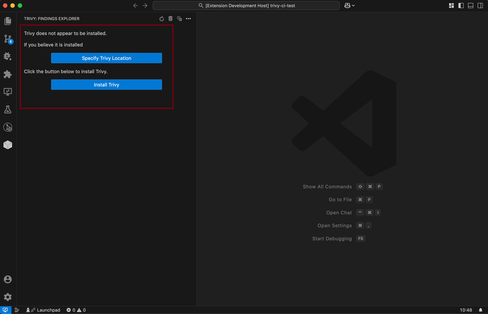

# Aqua Trivy

Trivy Vulnerability Scanner is a VS Code extension that helps you find vulnerabilities in your software projects
without leaving the comfort of your VS Code window.

## Requirements

Trivy is required for the plugin - if it is available on the `PATH` then the extension will use that version. If it can't be found, you will be presented with the choice of specifying where it is or installing.

If you choose to install, the output window will open with the details of what is being installed and where, it will be installed to the extensions directory and be removed when the extension is uninstalled.

## Usage

The Aqua Trivy extension comes with a walkthrough quick start to show you the key areas, we recommend you look at that the first time you use it.

When the extension is opened and Trivy is installed, you can run a scan of the current project or workspaces and it will generate a list of issues broken down by file.

The menu allows you to turn on workspace specific options as part of the scan.

## Aqua Plugin

If you are an Aqua customer, you can use your `AQUA_KEY` and `AQUA_SECRET` to get additional assurance policy results.

### Configure for Aqua Platform

From the menu, select `Trivy Aqua Platform Integration` and provide your Aqua details.

Now run a scan as normal and you will have additional policy results.

## Known Issues

If you find one, please file a GitHub Issue [here](https://github.com/aquasecurity/trivy-vscode-extension/issues/new).

## Feature Requests

Have a feature you desire? Please let us know by filing an issue [here](https://github.com/aquasecurity/trivy-vscode-extension/issues/new).

## Release Notes

### 1.0.1

- Fix issue with required resources and node_modules for webview

### 1.0.0

- Add support for installing and updating a built in version of Trivy
- Add support for the Aqua plugin
  - Use Aqua Key and Secret to get Assurance results
- Rework the Tree view to be more informative
- Only allow single runs to happen at anyone time
- Rework the icons to be more consistent
- Switch to using webpack to package vsix and streamline significantly

### 0.9.0

- Add Trivy findings to the Problems view

### 0.8.0

- Add support for managing the config through the UI
- Add support for multiple workspaces in the explorer
- Add tests and process around the code

### 0.6.1

Handle findings inside tarballs

### 0.6.0

Add support for secrets - turn on in the extension settings

### 0.5.1

Fix json check

### 0.5.0

Add support for newer format of json results

### 0.4.1

Fix typo in the configuration settings

### 0.4.0

Add additional settings for offline and minimum severity

### 0.3.0

Add Findings viewer and help

### 0.2.0

Automatic detection of old Trivy versions.

### 0.1.1

Initial release with basic project scanning.
