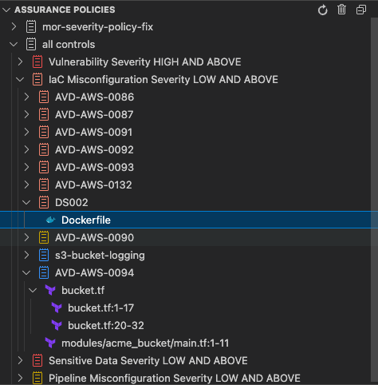

# Aqua Platform Integration

Connect the Aqua Trivy VS Code Extension to Aqua Platform for enhanced security policies, compliance frameworks, and centralized security management.

## Overview

Aqua Platform integration provides:

- **Compliance Frameworks**: Industry-standard compliance checking
- **Centralized Management**: Unified security posture across teams
- **Custom Policies**: Organization-specific security rules

## Prerequisites

### Aqua Platform Account

- Active Aqua Platform subscription
- Access to Aqua Console
- API credentials (Key and Secret)

## Configuration

### Step 1: Obtain Aqua Credentials

1. **Log into Aqua Platform**

   - Navigate to your Aqua Platform instance
   - Go to **Account Management** > **Settings** > **API Keys**

2. **Generate API Credentials**

   - Click **Generate Key**
   - Note down the **Aqua Key** and **Aqua Secret**

3. **Identify Your Region**
   - Note your Aqua Platform region
   - This will be needed for API configuration

### Step 2: Configure Extension

1. **Open Trivy Menu**

   - Click on the `...` of the Trivy Findings UI

2. **Select Platform Integration**

   - Choose **Trivy Aqua Platform Integration**
   - A configuration dialog will appear

3. **Enter Credentials**
   - **Aqua Key**: Your API key
   - **Aqua Secret**: Your API secret
   - **Region**: Select your Aqua Platform region
   - Click **Save** to apply settings

### Step 3: Verify Configuration

1. **Run a Scan**

   - Execute a normal Trivy scan
   - Check the Output panel for Aqua Platform connection logs

2. **Check Assurance Explorer**
   - The "Trivy Assurance" view should appear
   - Assurance Policy results should populate after scanning

## Using Aqua Platform Features

### Assurance Explorer

Once configured, the Assurance Explorer shows:

#### Policy Structure



Benefits:

- **Centralized Dashboard**: View all scan results in Aqua Console
- **Historical Tracking**: Trend analysis over time
- **Team Collaboration**: Share findings across team members
- **Compliance Reporting**: Automated compliance reports

## Troubleshooting

### Common Issues

#### Authentication Failures

**Symptoms**: No assurance results, authentication errors in output

**Solutions**:

1. Verify credentials are correct
2. Check network connectivity to Aqua Platform
3. Ensure API key has appropriate permissions
4. Validate region/URL configuration

#### Missing Policy Results

**Symptoms**: Findings Explorer works but no Assurance Explorer

**Solutions**:

1. Confirm `trivy.useAquaPlatform` is enabled
2. Check that policies are assigned to your scope
3. Verify scan includes relevant file types
4. Review output panel for policy evaluation logs

#### Slow Performance

**Symptoms**: Scans take much longer with Aqua Platform enabled

**Solutions**:

1. Check network latency to Aqua Platform
2. Consider using offline mode for development
3. Optimize scan scope to reduce API calls
4. Contact Aqua support for performance tuning

### Debug Information

Enable detailed logging:

```json
{
  "trivy.debug": true
}
```

Check Output panel for:

- Authentication success/failure
- Policy download status
- API response details
- Network connectivity issues

### Validation Commands

Verify configuration using Trivy CLI:

```bash
# Test authentication
trivy plugin list | grep aqua

# Test scan with Aqua Platform
trivy fs --format json --security-checks vuln,config,secret .
```

## Best Practices

### Security

1. **Use Environment Variables**: Store credentials securely
2. **Rotate Keys Regularly**: Update API keys periodically
3. **Scope Permissions**: Limit API key permissions to necessary actions
4. **Network Security**: Ensure secure connection to Aqua Platform

### Performance

1. **Selective Scanning**: Only enable for relevant projects
2. **Cache Results**: Leverage Aqua Platform caching where possible
3. **Batch Operations**: Group related scans together
4. **Monitor Usage**: Track API usage against limits

### Workflow Integration

1. **Development Phase**: Use standard Trivy scanning
2. **Pre-commit**: Enable Aqua Platform for compliance checks
3. **CI/CD Integration**: Upload results for centralized tracking
4. **Release Gates**: Use policy results for deployment decisions

## Team Configuration

### Shared Settings

Create team-wide configuration:

```json
// .vscode/settings.json (committed to repository)
{
  "trivy.useAquaPlatform": true,
  "trivy.aquaApiUrl": "https://api.company-region.aquasec.com"
}
```

### Additional Resources

- [Aqua Platform Documentation](https://docs.aquasec.com/)
- [Trivy Documentation](https://aquasecurity.github.io/trivy/)
- [Extension GitHub Repository](https://github.com/aquasecurity/trivy-vscode-extension)

## Next Steps

- [Understanding Views](./views.md) - Learn about Assurance Explorer details
- [Command Reference](./commands.md) - Platform-specific commands
- [Troubleshooting](./troubleshooting.md) - Additional troubleshooting guides
