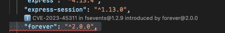

# CodeLens Integration

CodeLens provides inline code annotations that display security information directly in the editor, offering immediate visibility into vulnerabilities and security issues.

## CodeLens Overview

### File-Level CodeLens

Appears at the top of files:

## Next Steps

- [Views Overview](./views.md) - Complete views documentation
- [Tree View](./tree-view.md) - Tree view explorer details
- [Problems Panel](./problems-view.md) - Problems integration
- [Commands Reference](./commands.md) - All available commands
