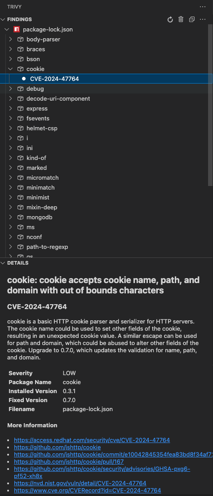

# Quick Start Guide

Get up and running with the Aqua Trivy VS Code Extension in just a few minutes.

## Walkthrough

The extension includes an interactive walkthrough:

1. Press `F1` or `Ctrl+Shift+P` / `Cmd+Shift+P`
2. Type "Welcome: Open Walkthrough"
3. Look for "Aqua Trivy" in the list

Alternatively, follow these step...

## Step 1: Open Your Project

1. Open VS Code
2. Open a folder containing code you want to scan (`File > Open Folder...`)
3. The Trivy extension will automatically activate

## Step 2: Access the Trivy Views

Look for the Trivy icon in the Activity Bar (left sidebar). Click it to open the Trivy panel, which contains:

- **Findings Explorer** - Shows vulnerabilities, misconfigurations, and secrets
- **Assurance Explorer** - Shows Aqua Platform policy results (if configured)
- **Help View** - Displays detailed information about selected issues

## Step 3: Run Your First Scan

### Using the Trivy Panel

1. Click the Trivy icon in the Activity Bar
2. Click the **Scan** button in the Findings Explorer header

## Step 4: Review Results

After the scan completes, you'll see results in multiple places:

### Findings Explorer

- Organized by file or severity (configurable)
- Click items to navigate to the issue location
- Expand items to see detailed information

### Problems Panel

- Access via `View > Problems` or `Ctrl+Shift+M` / `Cmd+Shift+M`
- Shows Trivy findings alongside other VS Code diagnostics
- Click items to jump to the issue

### Help View

- Select any finding in the explorer
- The Help View shows detailed information about the selected issue
- Includes remediation advice and links to more information

## Step 5: Navigate and Fix Issues

### Opening Files

- Click any finding to open the file at the specific line
- Use CodeLens indicators for transitive dependencies
- Hover over issues for quick information

### Understanding Severity Levels

- **Critical** (🔴): Immediate attention required
- **High** (🟠): Important security issues
- **Medium** (🟡): Moderate security concerns
- **Low** (🔵): Minor issues
- **Unknown** (⚪): Unclassified issues

## Common First Steps

### Configure Scan Types

By default, Trivy scans for:

- ✅ Vulnerabilities
- ✅ Misconfigurations
- ❌ Secrets (disabled by default)

To enable secrets scanning:

1. Open Settings (`Ctrl+,` / `Cmd+,`)
2. Search for "trivy secret"
3. Enable **Trivy: Secret Scanning**

### Set Minimum Severity

To focus on high-priority issues:

1. Open Settings (`Ctrl+,` / `Cmd+,`)
2. Search for "trivy minimum"
3. Set **Trivy: Minimum Reported Severity** to your preferred level

### Use the Menu

Many settings are available from the `...` menu in the Trivy view:

- Scan types (vulnerabilities, misconfigurations, secrets)
- Offline scanning
- Fixed issues only
- Ignore file usage

## What's Next?

Now that you've run your first scan:

- [Learn about Views](./views.md) - Understand the different panels and their purposes
- [Configure Settings](./settings.md) - Customize the extension for your workflow
- [Set up Aqua Platform](./aqua-platform.md) - Enhanced security policies (for Aqua customers)
- [Advanced Scanning](./scanning.md) - Learn about different scan types and options

## Tips for Success

1. **Start Small**: Begin with a small project to understand the output
2. **Review Settings**: Customize scan types based on your project needs
3. **Use Filters**: Focus on Critical and High severity issues first
4. **Regular Scans**: Make scanning part of your development workflow
5. **Learn Patterns**: Understanding common vulnerability types helps with remediation

## Getting Help

If you encounter issues:

- Check the [Troubleshooting Guide](./troubleshooting.md)
- Review the Output panel in VS Code (select "Trivy" from the dropdown)
- Visit the [GitHub repository](https://github.com/aquasecurity/trivy-vscode-extension) for support
