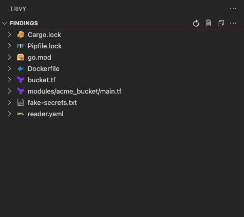
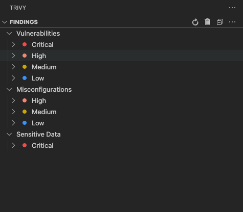

# Scanning Your Projects

Learn how to effectively scan your projects for vulnerabilities, misconfigurations, and secrets using the Trivy VS Code Extension.

## Starting a Scan

### Trivy Panel

- Click the Trivy icon in the Activity Bar
- Click the **Scan** button in the explorer header

## Scan Types

The extension supports three types of security scanning:

### Vulnerability Scanning

- **What it finds**: Known security vulnerabilities in dependencies
- **File types**: package.json, go.mod, requirements.txt, pom.xml, etc.
- **Default**: Enabled
- **Quick toggle**: Menu > "Scan for vulnerabilities"

### Misconfiguration Scanning

- **What it finds**: Security misconfigurations in IaC files
- **File types**: Dockerfile, Kubernetes YAML, Terraform, CloudFormation, etc.
- **Default**: Enabled
- **Quick toggle**: Menu > "Scan for misconfigurations"

### Secret Scanning

- **What it finds**: Exposed secrets, API keys, passwords, tokens
- **File types**: All text files
- **Default**: Disabled (requires Trivy ≥v0.27.0)
- **Quick toggle**: Menu > "Scan for sensitive data"

## Understanding Scan Results

### Result Organization

Results can be organized in two ways:

#### By File (Default)



#### By Type and Severity



Toggle between views: Menu > "Order results by type and severity"

### Severity Levels

| Severity | Color     | Description               | Action Required       |
| -------- | --------- | ------------------------- | --------------------- |
| Critical | 🔴 Red    | Severe security risks     | Immediate fix         |
| High     | 🟠 Orange | Important security issues | Fix soon              |
| Medium   | 🟡 Yellow | Moderate concerns         | Address when possible |
| Low      | 🔵 Blue   | Minor issues              | Low priority          |
| Unknown  | ⚪ White  | Unclassified              | Review manually       |

## Scan Options

### Offline Scanning

- **Purpose**: Scan without internet connectivity
- **Note**: May miss latest vulnerability data
- **Toggle**: Menu > "Offline scanning"

### Fixed Issues Only

- **Purpose**: Show only vulnerabilities with available fixes
- **Use case**: Focus on actionable items
- **Toggle**: Menu > "Only show fixed issues"

### Minimum Severity

- **Purpose**: Filter out low-priority findings
- **Options**: Critical, High, Medium, Low, Unknown
- **Setting**: Trivy: Minimum Reported Severity

### Package Scanning Options

Control scanning of dependency files without lock files:

- **Package.json scanning** (Node.js projects)
- **Gradle scanning** (Java projects)
- **.NET project scanning** (C# projects)

## Advanced Scanning Features

### Using Ignore Files

Create a `.trivyignore.yaml` file in your project root:

```yaml
# Ignore specific vulnerabilities
vulnerabilities:
  - id: CVE-2021-12345
    paths:
      - 'package.json'

# Ignore specific misconfigurations
misconfigurations:
  - id: DS002
    paths:
      - 'Dockerfile'
```

Enable ignore file usage:

- Menu > "Use ignore file"
- Or set custom path: Menu > "Set trivy ignore file"

### Using Configuration Files

Create a `trivy.yaml` file for advanced configuration:

```yaml
# Scanner configuration
scanners:
  - vuln
  - misconfig
  - secret

# Vulnerability settings
vulnerability:
  type:
    - os
    - library
  severity:
    - CRITICAL
    - HIGH
    - MEDIUM

# Misconfiguration settings
misconfig:
  severity:
    - CRITICAL
    - HIGH

# Secret settings
secret:
  severity:
    - CRITICAL
    - HIGH
    - MEDIUM
```

Enable config file:

- Menu > "Use config override"
- Or set custom path: Menu > "Set explicit config file"
- Or use only config file: Menu > "Only use config file"

## Scan Performance

### Improving Scan Speed

1. **Use .gitignore**: Menu > "Ignore files in .gitignore"
2. **Set minimum severity**: Focus on important issues only
3. **Disable unused scanners**: Turn off secret scanning if not needed
4. **Use ignore files**: Skip known false positives

### Multi-Workspace Support

For projects with multiple workspace folders:

- Each workspace is scanned separately
- Results are organized by workspace
- Single workspace folders show results directly

## Monitoring Scan Progress

### Output Panel

1. Open VS Code Output panel (`View > Output`)
2. Select "Trivy" from the dropdown
3. Monitor scan progress and debug information

### Status Indicators

- Scanning in progress: Loading indicators in explorers
- Scan complete: Results populate in views
- Scan errors: Check Output panel for details

## Troubleshooting Scans

### Common Issues

#### No Results After Scan

- Check if files contain supported formats
- Verify scan types are enabled
- Review minimum severity settings
- Check Output panel for errors

#### Slow Scans

- Enable offline mode for faster scanning
- Use .gitignore to exclude unnecessary files
- Reduce scan types if not all are needed

#### Permission Errors

- Ensure Trivy binary has execution permissions
- Check file system permissions for scanned directories
- Review Output panel for specific error messages

### Getting Debug Information

Enable debug mode for detailed logging:

1. Open Settings (`Ctrl+,` / `Cmd+,`)
2. Search for "trivy debug"
3. Enable **Trivy: Debug**
4. Check Output panel for verbose information

## Best Practices

1. **Regular Scanning**: Make scanning part of your development workflow
2. **Start Early**: Scan during development, not just before deployment
3. **Focus on Fixable**: Use "fixed issues only" to prioritize actionable items
4. **Use Ignore Files**: Document and track accepted risks
5. **Configure Appropriately**: Adjust severity levels based on your security requirements
6. **Monitor Trends**: Regular scans help track security posture over time

## Next Steps

- [Understand Views](./views.md) - Learn about the different result views
- [Configure Settings](./settings.md) - Customize scanning behavior
- [Aqua Platform Integration](./aqua-platform.md) - Enhanced scanning with Aqua Platform
