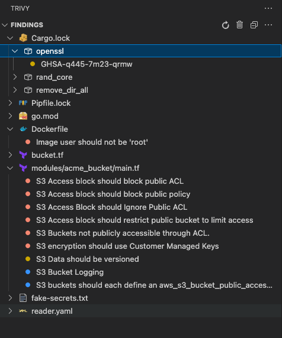

# Tree View Explorer

The Trivy VS Code Extension provides dedicated tree view explorers to organize and display security findings.

## Tree Views Overview

### Trivy Findings Explorer

- **Purpose**: Display vulnerabilities and general security findings
- **Location**: Activity bar or Explorer panel
- **Icon**: Trivy logo with security badge

### Trivy Assurance Explorer

- **Purpose**: Display compliance and policy findings
- **Location**: Activity bar or Explorer panel
- **Icon**: Trivy logo with shield badge

## Tree Structure

### Hierarchical Organization



### Node Types

#### Severity Nodes

- **CRITICAL**: Red circle (🔴)
- **HIGH**: Orange circle (🟠)
- **MEDIUM**: Yellow circle (🟡)
- **LOW**: Blue circle (🔵)
- **UNKNOWN**: Gray circle (⚪)

### Toolbar Actions

#### Refresh Actions

- **Refresh**: Update tree with latest scan results
- **Clear**: Reset tree view state
- **Rescan**: Trigger new Trivy scan

#### Filter Actions

- **Filter by severity**: Show/hide severity levels
- **Group by type**: Organize by finding type
- **Sort options**: Change result ordering

## Tree View Customization

### Display Settings

#### Result Ordering

- **By severity**: Group critical issues first
- **By file**: Organize by file structure
- **By type**: Group by vulnerability type

```json
{
  "trivy.orderResultsByType": true
}
```

#### Severity Filtering

Hide lower severity findings:

```json
{
  "trivy.minimumReportedSeverity": "HIGH"
}
```

## Next Steps

- [Views Overview](./views.md) - Complete views documentation
- [Problems Panel](./problems-view.md) - Problems integration
- [CodeLens Integration](./codelens.md) - Inline code annotations
- [Commands Reference](./commands.md) - All available commands
